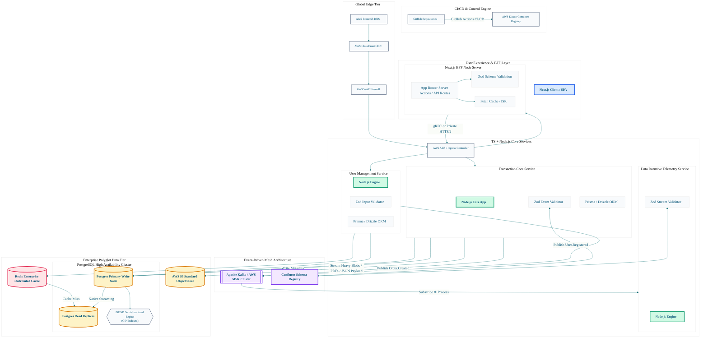

# System Architecture

---

## Table of Contents
1. [Planning & Research](#planning--research)
    - [Defining the Problem](#defining-the-problem)
    - [User Research & Trade-Offs](#user-research--trade-offs)
2. [Architecture Overview](#architecture-overview)
   - [Backend](#backend)
   - [Data Handling — Hybrid Database (PostgreSQL + Redis)](#data-handling--hybrid-database-postgresql--redis)
   - [Frontend — Next.js BFF](#frontend--nextjs-bff)
3. [Event-Driven Architecture (EDA)](#event-driven-architecture-eda)
4. [System Diagram](#system-diagram)

---

## Planning & Research

### Defining the Problem

Every data-intensive system starts with one plain-English sentence:

> **A specific group of people cannot do a specific thing efficiently because of a specific constraint. This system removes that constraint.**

From this anchor, work outward before touching code:

- **Who are the users?** What do they already use? What do they expect in terms of speed and reliability?
- **What does the data look like?** How does it arrive — form submissions, file uploads, external API webhooks, scheduled jobs? How much of it? How fast?
- **What are the read patterns?** Is data read frequently by many people, or rarely by a few? Are reads simple lookups or complex aggregations?
- **What are the write patterns?** Are writes frequent and small (user events) or infrequent and large (batch jobs)?
- **What fails badly?** If the system is slow, what is the user impact? If it goes down, what breaks?

### User Research & Trade-Offs

Before architecture is designed, the most important trade-offs must be made explicitly:
```
|
 Trade-off 
|
 Question to answer first 
|
|
---
|
---
|
|
 Consistency vs. Speed 
|
 Do all users need to see the exact same data at the exact same moment? Or is slightly stale data acceptable in exchange for faster reads? 
|
|
 Relational vs. Document 
|
 Is the data highly structured with enforced relationships? Or does its shape vary and evolve rapidly? 
|
|
 Synchronous vs. Async 
|
 Does the user need to wait for an operation to complete, or can it happen in the background while they continue? 
|
|
 Durable vs. Ephemeral 
|
 Does this data need to survive a server restart, or is it session-scoped and acceptable to lose? 
|
|
 Monolith vs. Services 
|
 Is the team small enough to benefit from a single deployable unit, or large enough that independent scaling matters? 
|
```
---

## Architecture Overview

The system is organized into four layers. Each layer has a single, well-defined responsibility and communicates with adjacent layers through defined contracts.

```
[CLIENT]  →  [BFF / API GATEWAY]  →  [SERVICE LAYER]  →  [DATA LAYER]
                                                               ↓
                                              [PostgreSQL] [Redis] [S3]
```

---

### Backend

#### Entry Point & Gateway

All inbound traffic passes through a single entry point before reaching any business logic.

**Responsibilities:**
- **Authentication** — verify the caller's identity using JWT tokens or session cookies. Reject unauthenticated requests before they go any further.
- **Authorization** — check that the authenticated caller has permission to perform the requested operation on the requested resource.
- **Rate limiting** — prevent any single caller from overwhelming the system. Track request counts per user/IP in Redis (fast, ephemeral — ideal for this purpose).
- **Request parsing and validation** — parse the incoming payload and validate its shape using **Zod** schemas. A request that fails validation is rejected with a clear, structured error response. It never reaches business logic.

**Zod validation example:**

```typescript
import { z } from 'zod';

const CreateOrderSchema = z.object({
  userId: z.string().uuid(),
  items: z.array(z.object({
    productId: z.string().uuid(),
    quantity: z.number().int().positive().max(100),
  })).min(1),
  shippingAddress: z.object({
    street: z.string().min(1),
    city: z.string().min(1),
    postalCode: z.string().regex(/^\d{5}(-\d{4})?$/),
  }),
});

type CreateOrderInput = z.infer;
```

> **Why Zod?** Zod schemas serve as the single source of truth for both runtime validation and TypeScript types. When the schema changes, the types change automatically — no drift between validation rules and type definitions.

#### Service Layer (Business Logic)

The service layer applies the rules of the domain. It has no knowledge of HTTP, databases, or network protocols. It only understands the language of the business:

- Check if a user is allowed to place an order.
- Calculate the total cost of a cart including applicable discounts.
- Determine whether an item is in stock.
- Decide whether to approve or flag a transaction.

The service layer receives validated, typed inputs from the gateway and returns domain objects. It delegates all I/O to the data access layer.

#### Data Access Layer

The data access layer translates between the service layer's domain language (TypeScript objects, value types) and the storage layer's language (SQL rows, Redis keys, S3 paths). It is the only layer that is allowed to touch the database directly.

**Responsibilities:**
- Execute reads and writes against PostgreSQL, Redis, and S3.
- Handle database errors and translate them into domain-level errors the service layer can understand.
- Manage connection pooling (via **pg** or **Prisma**) to prevent connection exhaustion.
- Implement the caching strategy — check Redis before hitting PostgreSQL; write to Redis after a successful PostgreSQL read.

---

### Data Handling — Hybrid Database (PostgreSQL + Redis)

This system uses a hybrid storage strategy: **PostgreSQL** for durable, relational, queryable data — and **Redis** for fast, ephemeral, frequently-accessed data. Each serves a fundamentally different purpose. The key discipline is knowing which data belongs where.

#### PostgreSQL — The Source of Truth

PostgreSQL stores all data that must be durable, consistent, and queryable across relationships. It is the system of record — if Redis is lost entirely, nothing permanent is lost, because PostgreSQL holds the ground truth.

**Use PostgreSQL for:**
- User accounts, roles, and permissions
- Orders, transactions, invoices
- Structured records with relationships (user → orders → items → products)
- Audit logs and history
- Any data that must survive a server restart

**JSONB for semi-structured data:**

PostgreSQL's `JSONB` column type allows flexible, schema-less sub-documents within an otherwise relational table. This is the right choice when a record's shape varies between rows (e.g., different product types with different attributes, or event payloads with variable fields).

```sql
CREATE TABLE events (
  id          UUID PRIMARY KEY DEFAULT gen_random_uuid(),
  type        TEXT NOT NULL,
  payload     JSONB NOT NULL,
  user_id     UUID REFERENCES users(id),
  created_at  TIMESTAMPTZ DEFAULT NOW()
);

-- Query inside the JSONB payload
SELECT * FROM events
WHERE payload->>'orderId' = '88421'
AND type = 'ORDER_PLACED';

-- Index a frequently-queried JSONB field
CREATE INDEX idx_events_order_id ON events ((payload->>'orderId'));
```

> **When to use JSONB vs. relational columns:** Use relational columns when the field is queried, filtered, joined, or aggregated. Use JSONB when the field is stored and retrieved as a blob, rarely queried, or has a shape that varies between rows.

#### Redis — The Speed Layer

Redis sits in front of PostgreSQL for data that is read far more often than it is written, and where a few seconds of staleness is acceptable. It dramatically reduces database load and response latency.

**Use Redis for:**
- **Session data** — keep user session state in Redis with a TTL. Fast to read, easy to expire.
- **API response caching** — cache the result of expensive PostgreSQL queries for a defined TTL.
- **Rate limiting counters** — increment a counter per user/IP per time window. Redis atomic operations make this race-condition-safe.
- **Pub/Sub event bus** — publish events between services. Consumers subscribe to channels and react asynchronously.
- **Leaderboards and real-time rankings** — Redis sorted sets make rank queries O(log N).
- **Distributed locks** — prevent two workers from processing the same job simultaneously.

**Cache-aside pattern (the standard approach):**

```typescript
async function getProduct(productId: string): Promise {
  const cacheKey = `product:${productId}`;

  // 1. Check Redis first
  const cached = await redis.get(cacheKey);
  if (cached) {
    return JSON.parse(cached) as Product;
  }

  // 2. Cache miss — query PostgreSQL
  const product = await db.query(
    'SELECT * FROM products WHERE id = $1', [productId]
  );

  // 3. Write to Redis with a 5-minute TTL
  await redis.set(cacheKey, JSON.stringify(product), 'EX', 300);

  return product;
}
```

#### Hypothetical Failure Scenarios

**Scenario 1: Redis goes down**

Redis is not the source of truth — PostgreSQL is. If Redis becomes unavailable, the cache-aside pattern degrades gracefully: every cache check throws or returns null, and the application falls through to PostgreSQL for every request. This increases database load significantly, but **no data is lost**. When Redis recovers, the cache warms up naturally as requests come in.

*Safeguard:* Implement a circuit breaker around Redis calls. If Redis is consistently unavailable, skip the cache check entirely instead of retrying on every request and adding latency.

```typescript
let redisAvailable = true;

async function getWithCache(key: string, fallback: () => Promise) {
  if (!redisAvailable) return fallback();
  try {
    const cached = await redis.get(key);
    if (cached) return JSON.parse(cached);
    const data = await fallback();
    await redis.set(key, JSON.stringify(data), 'EX', 300);
    return data;
  } catch (err) {
    redisAvailable = false;
    setTimeout(() => { redisAvailable = true; }, 30_000); // retry in 30s
    return fallback();
  }
}
```

**Scenario 2: PostgreSQL primary fails**

PostgreSQL should run in a primary + replica configuration. Replicas receive a continuous stream of write-ahead log (WAL) entries from the primary. If the primary fails:

1. A replica is promoted to primary (automatic with tools like Patroni, or manual with AWS RDS Multi-AZ).
2. The application's connection pool reconnects to the new primary.
3. Any writes that were in-flight at the moment of failure and not yet replicated are at risk of being lost — this is the replication lag window.

*Safeguard:* Use synchronous replication for critical write paths (e.g., financial transactions). Accept asynchronous replication for less critical data to preserve write throughput.

**Scenario 3: An S3 upload fails mid-transfer**

File uploads to S3 should use **multipart upload** for large files. If the upload fails partway through, the parts already uploaded are staged in S3 but not assembled. They incur storage costs without being useful.

*Safeguard:* Set a lifecycle policy on the S3 bucket to automatically delete incomplete multipart uploads after 24 hours. On the application side, catch upload errors and either retry the failed parts or delete all staged parts and return an error to the user.

**Scenario 4: A write succeeds in PostgreSQL but the Redis cache is not invalidated**

After a successful write to PostgreSQL, the code that was supposed to delete the stale cache key crashed before it could run. The cache now contains an outdated record.

*Safeguard:* Use TTLs on all cache entries as a safety net — even if invalidation fails, the cache will expire within the TTL window. For critical data, prefer shorter TTLs. For truly critical consistency requirements, skip caching entirely.

#### AWS S3 — Object Storage

S3 stores binary files and large objects that are not suitable for a relational database: user-uploaded files, exported reports, generated documents, images, and backups.

**Upload flow:**
1. The client requests a **pre-signed upload URL** from the backend.
2. The backend generates the URL using the AWS SDK and returns it to the client.
3. The client uploads the file directly to S3 — the file bytes never touch the application server.
4. S3 notifies the backend via an event (S3 event notification → message queue → consumer service) that the upload is complete.
5. The consumer service records the S3 object key in PostgreSQL, linking the file to the relevant record.

This pattern keeps large binary transfers out of the application layer and scales naturally with S3's throughput.

---

### Frontend — Next.js BFF

Next.js serves as the **Backend for Frontend (BFF)** — a thin server-side layer that sits between the browser and the backend services. Its purpose is not to contain business logic, but to:

- **Aggregate data** from multiple backend services into a single, page-shaped response.
- **Transform data** into the exact shape the UI needs — not the shape the backend stores it in.
- **Enforce access control** at the rendering layer — server components can check session cookies before deciding what to render.
- **Handle authentication flows** — OAuth callbacks, token refreshes, and session management happen in the BFF, not the browser.

#### Server Components vs. Client Components

Next.js 13+ introduced a clear separation between rendering contexts.

| Server Components | Client Components |
|---|---|
| Run on the server at request time (or build time for static). | Run in the browser after hydration. |
| Can access databases, environment variables, secrets directly. | Cannot access server-only resources. |
| Cannot use `useState`, `useEffect`, browser APIs. | Can use all React hooks and browser APIs. |
| Best for: data fetching, auth checks, layout. | Best for: interactivity, real-time updates, forms. |

#### Data Rendering Libraries\n
For mapping and rendering data-intensive interfaces in a Next.js + TypeScript environment:

**Tabular data:**
- **TanStack Table (React Table v8)** — headless table logic: sorting, filtering, pagination, grouping. No opinion on markup — you supply the JSX.
- **AG Grid Community** — full-featured data grid with virtual scrolling for large datasets.

**Charts and visualization:**
- **Recharts** — composable React chart components built on D3. Best for line, bar, area, and pie charts.
- **Tremor** — pre-built dashboard components (charts, KPI cards, stat blocks) designed for admin interfaces.
- **Victory** — React + React Native compatible charting.
- **Observable Plot** — powerful D3-based library for exploratory data visualization.

**Forms and validation:**
- **React Hook Form** — performant, uncontrolled form management. Integrates directly with Zod via the `@hookform/resolvers` package — the same Zod schemas used for backend validation can be reused on the frontend.
- **Radix UI** — unstyled, accessible form primitives (combobox, select, checkbox, dialog).

**Data fetching and synchronization:**
- **TanStack Query (React Query)** — manages server state: caching, background refetching, loading/error states, optimistic updates, and real-time synchronization via `refetchInterval` or WebSocket integration.
- **SWR** — lightweight alternative to React Query for simpler caching and revalidation needs.

**Real-time data:**
- **socket.io-client** — WebSocket client that pairs with socket.io on the Node.js backend.
- **EventSource (native browser API)** — for consuming Server-Sent Events streams from Next.js API routes.

---

### Data Rendering

**Next.js** can map and render data charts perfectly. Next.js is a full-stack React framework, meaning you can manipulate your data using standard JavaScript functions (like .map(), .filter(), and .reduce()) and feed it directly into powerful React charting libraries.Because Next.js supports both server-side and client-side processing, you can choose exactly where the data is processed and how the charts are rendered.

---

#### Data Mapping

- [Next.js + Zod Server Architecture](DataMapping.md)

## System Design Diagram

> **When to generate this diagram:** Produce it after the Architecture Overview is complete and all major data flows are agreed upon, but before any infrastructure is provisioned. Use it to validate alignment with all stakeholders. Update it whenever a significant architectural decision changes — a stale diagram is actively harmful.

```
[ User Browser / Client ]
           │  ▲
           ▼  │  HTTPS / WSS
┌────────────────────────────────────────────────────────┐
│ NEXT.JS BFF TIER                                       │
│ • Next.js App Router (SSR/ISR)  • Route Handlers (BFF) │
└──────────────────────────┬─────────────────────────────┘
                           │  ▲
                           ▼  │  gRPC / Internal REST
┌────────────────────────────────────────────────────────┐
│ NODE.JS / TYPESCRIPT CORE BACKEND SERVICES             │
│ • API Gateway    • Core Services    • Zod Validation   │
└────────────┬─────────────┬─────────────┬───────────────┘
             │             │             │
   Reads/    │             │             │ Publish/
   Writes    ▼             ▼             ▼ Subscribe
┌────────────┴────────┐ ┌──┴──────────┐ ┌────────────────┐
│ HYBRID STORAGE TIER │ │ FILE STORE  │ │ EVENT BROKER   │
│ • PostgreSQL        │ │ • AWS S3    │ │ • BullMQ       │
│   (Relational +     │ └─────────────┘ │   (via Redis)  │
│    JSONB Document)  │                 │ • Apache Kafka │
│ • Redis Cache       │                 └────────────────┘
└─────────────────────┘
```



---

## Event-Driven Architecture (EDA)

### What is an Event?

An event is a record that something happened. It is a fact — immutable, past tense. It does not tell other parts of the system what to do. It simply states: *this thing occurred, at this time, with this data.*

```
{
  "eventType": "ORDER_PLACED",
  "eventId": "evt_7a93bc",
  "timestamp": "2026-05-28T14:32:00.000Z",
  "payload": {
    "orderId": "88421",
    "userId": "usr_1047",
    "total": 149.99,
    "itemCount": 3
  }
}
```

The `ORDER_PLACED` event does not say "send a confirmation email" or "decrement inventory." Those are decisions made by the services that receive the event. The event itself is neutral — it is a fact about what happened.

This is the core discipline of EDA: **services communicate through facts, not instructions.** Instead of Service A directly calling Service B and telling it what to do, A emits a fact and any service that cares about that fact reacts independently.

### Why Event-Driven? The Problem It Solves

In a tightly-coupled system:

```
Order Service  →  directly calls  →  Email Service
Order Service  →  directly calls  →  Inventory Service
Order Service  →  directly calls  →  Analytics Service
```

If Email Service is slow, Order Service is slow. If Inventory Service is down, Order Service fails. Adding a new Analytics Service requires modifying Order Service's code.

In an event-driven system:

```
Order Service  →  emits "ORDER_PLACED"  →  Message Bus
                                              ↓
                          Email Service  (subscribes, reacts)
                          Inventory Service (subscribes, reacts)
                          Analytics Service (subscribes, reacts)
```

Order Service does not know any of these consumers exist. Adding a new consumer requires no changes to Order Service. A failure in Email Service does not affect order processing.

## System Diagram

```
[ User Browser / Client ]
           │  ▲
           ▼  │  HTTPS / WSS
┌────────────────────────────────────────────────────────┐
│ NEXT.JS BFF TIER                                       │
│ • Next.js App Router (SSR/ISR)  • Route Handlers (BFF) │
└──────────────────────────┬─────────────────────────────┘
                           │  ▲
                           ▼  │  gRPC / Internal REST
┌────────────────────────────────────────────────────────┐
│ NODE.JS / TYPESCRIPT CORE BACKEND SERVICES             │
│ • API Gateway    • Core Services    • Zod Validation   │
└────────────┬─────────────┬─────────────┬───────────────┘
             │             │             │
   Reads/    │             │             │ Publish/
   Writes    ▼             ▼             ▼ Subscribe
┌────────────┴────────┐ ┌──┴──────────┐ ┌────────────────┐
│ HYBRID STORAGE TIER │ │ FILE STORE  │ │ EVENT BROKER   │
│ • PostgreSQL        │ │ • AWS S3    │ │ • BullMQ       │
│   (Relational +     │ └─────────────┘ │   (via Redis)  │
│    JSONB Document)  │                 │ • Apache Kafka │
│ • Redis Cache       │                 └────────────────┘
```


