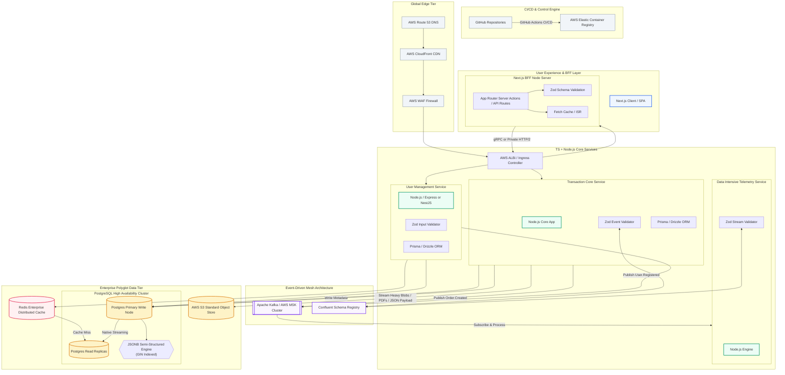

# System Architecture

---

This Enterprise System Architecture Plan outlines a high-throughput, resilient infrastructure designed for data-intensive operations using a TypeScript/Node.js core, a Next.js Backend-for-Frontend (BFF), and a hybrid database tier.

## Table of Contents
1. [End-to-End Development Cycle & Data Flow](#end-to-end-development-cycle--data-flow)
   - [Data Distribution Strategy](#data-distribution-strategy)
   - [Disaster Recovery & Fault Mitigation Scenarios](#disaster-recovery--fault-mitigation-scenarios)
     * [Scenario A: Redis Cache Node Crashes Unexpectedly](#scenario-a-redis-cache-node-crashes-unexpectedly)
     * [Scenario B: Primary PostgreSQL Instance Fails Mid-Transaction](#scenario-b-primary-postgresql-instance-fails-mid-transaction)
2. [Hybrid Database Management & Fault Tolerance](#-hybrid-database-management--fault-tolerance)
3. [Event-Driven Architecture (EDA) & Communication](#event-driven-architecture-eda--communication)
   - [Core Structural Setup](#core-structural-setup)
   - [Enterprise Event Catalog](#enterprise-event-catalog)
4. [Production Tech Stack, Frameworks & Dependencies](#production-tech-stack-frameworks--dependencies)
   - [Infrastructure & System Boundaries](#infrastructure--system-boundaries)
   - [Data Mapping & Access Libraries](#data-mapping--access-libraries)
   - [Data Rendering & Presentation Libraries](#data-rendering--presentation-libraries)
   - [Mermaid Architecture Diagram](#mermaid-architecture-diagram)
5. [Recommended Deployment Architecture](#recommended-deployment-architecture)
6. [System Design Diagram](#system-design-diagram)


## End-to-End Development Cycle & Data Flow

This cycle traces a single data payload from database ingestion to final screen rendering.

1. <mark>Backend Ingestion & Structural Validation</mark>
* **Strict Contracts**: Payload hits the Node.js/TypeScript backend API.
* **Runtime Verification**: Zod parses and validates incoming data at the API boundary, guaranteeing type safety before any database mutations occur.
2. <mark> Hybrid Database Layer Interaction</mark>
* **Relational Storage**: Core structured data writes to PostgreSQL tables.
* **Unstructured Scalability**: Semi-structured metadata writes to native JSONB columns.
* **Caching**: Frequently requested data drops into Redis with strict Time-To-Live (TTL) expiration window intervals.
3. <mark>Asynchronous Offloading (EDA)</mark>
* **Decoupling**: Heavy tasks (e.g., generating PDF reports, updating third-party webhooks) emit an event immediately to release the client thread.4
4. <mark>File Management</mark>
* **Object Storage**: Large unstructured binaries, images, or documents route directly to AWS S3 buckets using pre-signed secure URLs.
5. <mark>BFF Aggregation & Optimization</mark>
* **Tailored Payloads**: The Next.js BFF layer queries the core backend.Payload Trimming
* **Payload Trimming:** The BFF strips unnecessary fields, aggregates disparate microservices, and formats structural shapes strictly to match frontend UI components.
6. <mark>Frontend Rendering</mark>
* **Hybrid Layout Strategy**: The UI renders components via Server-Side Rendering (SSR) for real-time pages, Incremental Static Regeneration (ISR) for static catalogs, and Client-Side React components for private dashboards.

## 💾 Hybrid Database Management & Fault Tolerance

Using PostgreSQL and Redis in tandem balances sub-millisecond speeds with ironclad data persistence.


```
   [ Core Write Operation ]
                  │
         ┌────────┴────────┐
         ▼                 ▼
 ┌───────────────┐ ┌───────────────┐
 │ PostgreSQL    │ │ Redis Cache   │
 │ (ACID Write)  │ │ (Cache Write) │
 └───────┬───────┘ └───────┬───────┘
         │                 │
         ▼                 ▼
 ┌───────────────┐ ┌───────────────┐
 │ Streaming WAL │ │ AOF + RDB     │
 │ to Replica    │ │ Persistence   │
 ```

### Data Distribution Strategy
 * System of Record: PostgreSQL serves as the absolute source of truth, enforcing ACID compliance across relational data and indexes on performance-critical JSONB document keys.
 * Transient & Speed Layer: Redis handles real-time sessions, active user states, API rate limiting, and short-term caching

### Disaster Recovery & Fault Mitigation Scenarios

#### Scenario A: Redis Cache Node Crashes Unexpectedly
***The Risk: Sudden loss of volatile in-memory cached data, potentially triggering a "cache stampede" that crashes the primary PostgreSQL instance.***
* <mark>The Mitigation Plan</mark>
    - Enable Redis Append Only File (AOF) logged every second combined with periodic RDB snapshots to disk.
    - Implement Cache Aside Pattern: If a Redis cluster fails, the Next.js BFF falls back to PostgreSQL directly using an app-level circuit breaker (e.g., using opossum).
    - Deploy a Redis Sentinel or Redis Cluster on AWS ElastiCache for instantaneous, automated failover.

#### Scenario B: Primary PostgreSQL Instance Fails Mid-Transaction
***The Risk: Data corruption, lost financial transactions, or unrecoverable split-brain states.***
* <mark>The Mitigation Plan</mark>
    - Enforce synchronous Write-Ahead Logging (WAL) streamed directly to hot-standby replicas.
    - Use managed clustering tools like AWS Aurora or pgpool-II to execute automated health-checks and promote replicas to primary within seconds.
    - Ensure all write operations utilize explicit database transactions (BEGIN...COMMIT) so incomplete work automatically rolls back cleanly upon crash recovery.

### Event-Driven Architecture (EDA) & Communication
***To decouple service blocks, direct synchronous HTTP calls are replaced with asynchronous events.***
#### Core Structural Setup
* Message Broker / Queue: for job scheduling, queueing, and task decoupling.
* Distributed log stream: for enterprise-wide event broadcasting across microservices.
* Publisher-Subscriber Mechanism: independent services subscribe to topics without
  needing to know the identity of the event producer.


#### Enterprise Event Catalog
| Event Name | Producer Service | Consumer Service(s) | Payload Content Example | Intent / Action |
|---|---|---|---|---|
| `order.created` | Checkout API | Inventory, Notification | `{ "orderId": "1029", "total": 299.00 }` | Triggers inventory allocation and confirmation notification |
| `user.registered` | Auth Service | Analytics, CRM | `{ "userId": "usr_99", "email": "a@b.com" }` | Provisions user workspace and initializes analytics pipelines |
| `file.uploaded` | Upload Gateway | Media Processor | `{ "s3Url": "s3://...", "format": "pdf" }` | Starts background extraction and preview generation |

### Production Tech Stack, Frameworks & Dependencies
#### Infrastructure & System Boundaries
* Version Control & CI/CD: enterprise git workflows with automated validation,
  testing, and deployment pipelines.
* Data Validation & Typing: structural validation for incoming payloads and
  compile-time safety where possible.

#### Data Mapping & Access Libraries
* ORM / query builder: enables safe, maintainable data access and schema-aware
  operations.
* Cache client: supports fast lookup, distributed cache coordination, and
  cluster awareness.

#### Data Rendering & Presentation Libraries
* Application router: abstracts fetch patterns and enables efficient page
  rendering.
* Client-side data orchestration: handles caching, polling, and synchronization
  with backend data sources.
* UI component library: provides accessible, reusable presentation building
  blocks for dashboards and data-driven interfaces.

### Mermaid Architecture Diagram
The following architecture diagram is sourced from [`excess/diagram.md`](excess/diagram.md) and rendered using Mermaid.



### Source and Render Note
- Diagram source: `excess/diagram.md`
- GitHub Markdown can render Mermaid diagrams directly in preview.

### Recommended Deployment Architecture
***To handle these throughput tiers seamlessly, a Hybrid Containerized + Serverless Infrastructure deployed on AWS provides the optimal balance of scale, control, and performance.***

```
   [ Route 53 / AWS CloudFront ]
                    │
                    ▼
          [ AWS API Gateway / ALB ]
                    │
         ┌──────────┴──────────┐
         ▼                     ▼
┌──────────────────┐ ┌──────────────────┐
│  Next.js BFF     │ │  Node.js Core    │
│  (AWS Fargate /  │ │  Microservices   │
│   Vercel Infra)  │ │  (AWS EKS / ECS) │
└──────────────────┘ └──────────────────┘
```

1. Frontend & BFF Layer (Next.js)
* The Choice: Vercel Enterprise OR AWS ECS Fargate behind AWS CloudFront.
* Why: Vercel offers zero-configuration edge scaling for Next.js SSR/ISR. 
- If compliance requires full network isolation, hosting Next.js inside Docker containers on AWS ECS Fargate ensures your BFF sits in the exact same Virtual Private Cloud (VPC) as your core services, reducing network latency to sub-milliseconds.
2. Core Backend Services Tier (Node.js & TypeScript)
* The Choice: AWS EKS (Managed Kubernetes) or AWS ECS (Elastic Container Service) with AWS Fargate (Serverless Compute for Containers).
* Why: Fully serverless functions (like AWS Lambda) can suffer from "cold starts" and risk exhausting database connection pools during data-intensive bursts. Containers running on ECS or EKS remain active, maintain persistent TCP/gRPC connections, and utilize automated Horizontal Pod Autoscaling (HPA) based on CPU/Memory usage or custom event queue depths.
3. Managed Database TierPostgreSQL: Amazon Aurora PostgreSQL (Serverless v2). It auto-scales compute capacity up and down instantly based on application demand and provides automated storage scaling up to 128 TiB with high-performance replication.Redis: Amazon ElastiCache for Redis (Serverless) or Redis Enterprise Cloud. This setup abstracts cluster resizing and shard management entirely, handling millions of operations per second with microsecond latencies without operational overhead.

***To tailor this deployment template, would need to know: 
- target maximum budget limits or cloud cost constraints.
- Any specific regulatory compliance frameworks you must follow (e.g., SOC2, HIPAA, GDPR).
- Whether your engineering team is already experienced with Docker/Kubernetes or prefers a more managed PaaS/Serverless approach.
## System Design Diagram 

```
[ User Browser / Client ]
           │  ▲
           ▼  │  HTTPS / WSS
┌────────────────────────────────────────────────────────┐
│ NEXT.JS BFF TIER                                       │
│ • Next.js App Router (SSR/ISR)  • Route Handlers (BFF) │
└──────────────────────────┬─────────────────────────────┘
                           │  ▲
                           ▼  │  gRPC / Internal REST
┌────────────────────────────────────────────────────────┐
│ NODE.JS / TYPESCRIPT CORE BACKEND SERVICES             │
│ • API Gateway    • Core Services    • Zod Validation   │
└────────────┬─────────────┬─────────────┬───────────────┘
             │             │             │
   Reads/    │             │             │ Publish/
   Writes    ▼             ▼             ▼ Subscribe
┌────────────┴────────┐ ┌──┴──────────┐ ┌────────────────┐
│ HYBRID STORAGE TIER │ │ FILE STORE  │ │ EVENT BROKER   │
│ • PostgreSQL        │ │ • AWS S3    │ │ • BullMQ       │
│   (Relational +     │ └─────────────┘ │   (via Redis)  │
│    JSONB Document)  │                 │ • Apache Kafka │
│ • Redis Cache       │                 └────────────────┘
└─────────────────────┘
```
