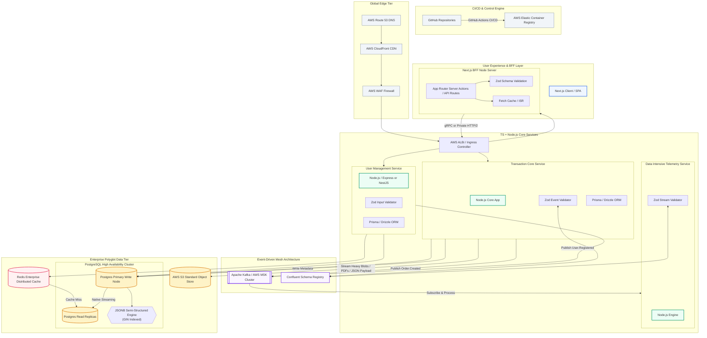

# Enhanced Architecture Design

This system leverages **Zod** at every structural layer to guarantee end-to-end data contract safety across distributed nodes. It isolates write-heavy workloads via a decoupled message broker, offloads high-volume document reads to an object store, and maximizes performance by embedding unstructured JSONB data models directly into highly indexed relational clusters.

## Technical Design Patterns Applied**

*   **Next.js BFF (Backend-For-Frontend)**: Acts as the exclusive orchestration and aggregation gatekeeper. By utilizing Server Actions and API routes running server-side, it handles data transformations, shields back-end APIs, prevents cross-origin resource sharing (CORS) leaks, and limits client bundle size.
    
*   **End-to-End Zod Integration**: Zod acts as the structural single source of truth. It validates inbound client parameters inside the BFF, checks execution payloads entering the microservices, and guarantees that any asynchronously structured event payloads conform strictly to schemas before database processing.
    
*   **Event-Driven Architecture (EDA)**: Implemented using Kafka/AWS MSK. Microservices do not directly execute remote procedural calls to each other. When an operation occurs (e.g., an order transaction), the Order Service logs state to its local data node and publishes an immutable event message to the broker. Downstream telemetry, notifications, and analytics consume this stream asynchronously, maintaining perfect service isolation.
    
*   **PostgreSQL Hybrid Storage & JSONB**: The operational system design leverages standard ACID tables for standard configurations alongside unstructured JSONB blobs for dynamic entities (like audit parameters or custom client attributes). This approach uses **Generalized Inverted Indexing (GIN)** to keep query performance for nested properties sub-millisecond.
    
*   **High-Volume Storage Tier**: Employs Redis as an ephemeral state repository to prevent read exhaustion on database replicas. Heavy transaction reports, system archives, and arbitrary data blobs bypass the database entirely and stream directly to **AWS S3** via pre-signed uniform resource locators.