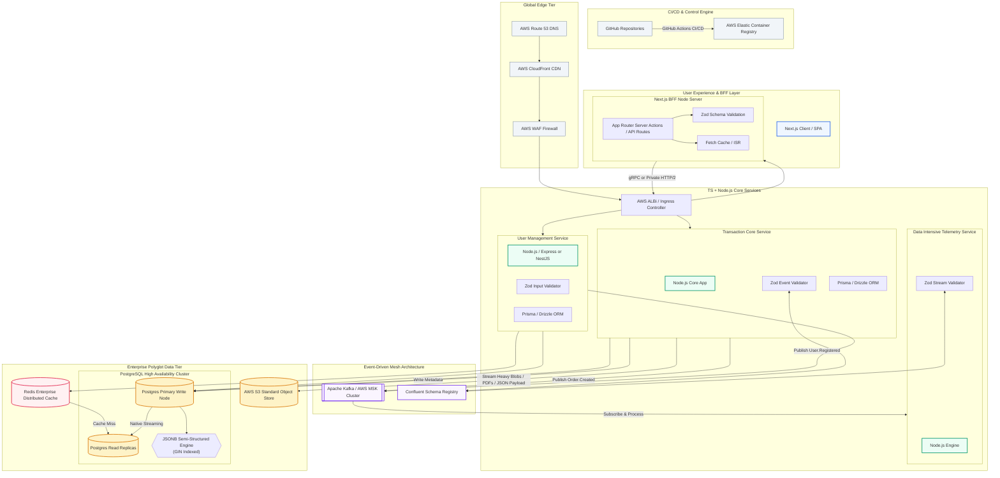

## System Architecture Plan

<!-- Use markdown to create a System Architectur Plan for an enterprise level, data-intensive system with a TypeScript + Node.js backend and Next.js for BFF. Must-Haves: A brief, but thorough, breakdown of the ***entire development cycle*** from backend server & data handling to frontend data rendering. This is a hybrid database, that will use PostgreSQL and Redis. Please explain how data can be handled in a hybrid database like this and include hypothetical scenarios (example: ways to prevent losing data if a server fails). The Tech Stack should include: ***TypeScript, JSONB, Zod, AWS S3, Redis, PostgreSQL, NextJS, GitHub, and any other necessary frameworks, libraries, and dependecies***. Please include a system design diagram and a thorough breakdown of how **Event-Driven Architecture (EDA)** will be used to decouple services and communicate asynchronously via events. Please include examples and explanations of these **events**. Please list libraries and frameworks that can be used for data mapping and rendering in this environment. 

- Please also include **trade-offs** for each service being used during each step of the Dev cycle, as well as safety guards that can be used to overcome potential hurdles.

 Refer to the NextJS Trade Off example below. Please proofread it, and add ways to overcome these hurdles.
- Please include a **system design diagram** using mermaid or a similar markdown diagram maker. Please include notes about exactly ***when in the development cycle*** this diagram should be generated.
-->

### System Design 

## NextJS as BFF Trade Off Example

### NextJS
- Dedicated, secure intermediary between your user interface and downstream microservices or third-party APIs. 
- Instead of exposing sensitive credentials or forcing the browser to fetch data from multiple databases, Next.js handles this logic securely on the server and delivers a single, tailored data payload directly to your frontend components

### Trade Offs that come with NextJS:
- Increased Latency & Network Hops: By routing client requests through Next.js proxy middleware to internal microservices, you add an extra network hop, increasing Time to First Byte (TTFB).
- Middleware Limitations: Next.js Edge Middleware executes before the route handler, meaning it can check for a cookie's presence but not necessarily its server-side validity or expiration.
- Duplicate Error/State Handling: You now have to manage session synchronization, caching strategies, and error handling across both your Next.js layer and your core backend services.
- Hosting Constraints: Deploying a full-scale Node.js server (required for complex, stateful BFFs) restricts you from simple static hosting. It often pushes you toward serverless or edge deployments optimized for platforms like Vercel.

